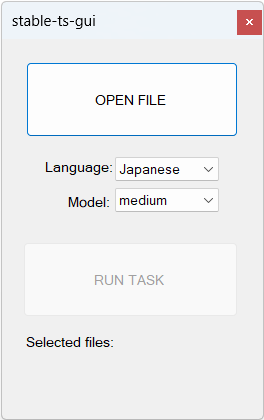

# stable-ts-gui
Simple gui version of [stable-ts](https://github.com/jianfch/stable-ts)


# Prerequisites
1. [Python 3.10.x](https://www.python.org/downloads/release/python-31011/)

2. Chocolatey (throw it at powershell.exe)
```
Set-ExecutionPolicy Bypass -Scope Process -Force; [System.Net.ServicePointManager]::SecurityProtocol = [System.Net.ServicePointManager]::SecurityProtocol -bor 3072; iex ((New-Object System.Net.WebClient).DownloadString('https://community.chocolatey.org/install.ps1'))
```

3. FFmpeg
```
choco install ffmpeg
```

4. PyTorch
```
pip install torch torchvision torchaudio --extra-index-url https://download.pytorch.org/whl/cu116
```

5. openai-whisper
```
pip install -U openai-whisper
```

6. stable-ts
```
pip install -U git+https://github.com/jianfch/stable-ts.git
```
